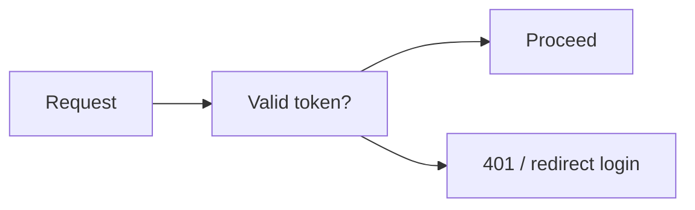
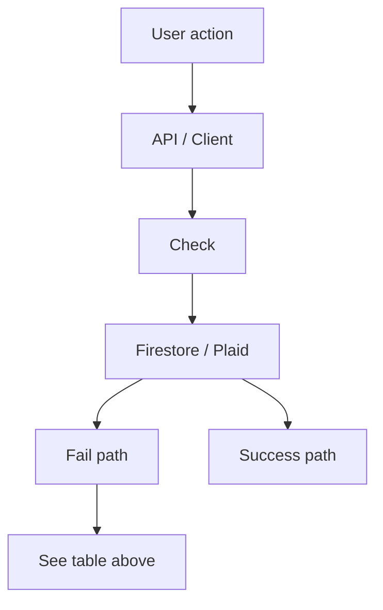

# Breakpoints and Fix Plan

**Summary:** Common failure points across the app, how to detect them, and how to fix them. Use with [ROUTES_AND_GATES.md](ROUTES_AND_GATES.md) and [DATA_FLOW_MAPS.md](DATA_FLOW_MAPS.md) to trace where data or auth can break.

**Acronyms:** API = Application Programming Interface; Firestore = Firebase Firestore; Plaid = bank-linking provider.

---

## ASCII: where things break

```
Visitor → Login
  └─ Break: wrong credentials, network → show error; retry

Login → Protected
  └─ Break: token expired, no user → layout redirect /auth/login

Protected → Connect Plaid
  └─ Break: create-link-token 401/500 → show error; check env PLAID_*
  └─ Break: exchange 409 BANK_ALREADY_CONNECTED → show "already connected"
  └─ Break: exchange 400 UNKNOWN_FIELDS (e.g. account_ids) → pass account_ids in options, not top-level
  └─ Break: exchange write Firestore "undefined" → strip undefined before .set(transactionData)

Plaid → Account usage → Auto-analyze
  └─ Break: account not found 404 → ensure account doc exists (exchange wrote it)
  └─ Break: no transactions → getTransactionsServer returns []; suggest sync or re-import

Auto-analyze → Analysis job
  └─ Break: Firestore permission on analysis_jobs → rules: get vs list; allow get for non-existent doc

Review → PUT /api/transactions/:id
  └─ Break: getTransactionServer is not a function → export getTransactionServer (singular) in transactions-server
  └─ Break: recordCorrection "undefined" in context.mcc → strip undefined (JSON.parse(JSON.stringify)) before user_corrections.set
  └─ Break: updateProgress permission → add rule user_profiles/{uid}/meta/{docId} read, write

Client transactions list
  └─ Break: useTransactions Firestore permission / index → fallback GET /api/transactions; ensure or(userId, user_id) in query for legacy data
  └─ Break: only "recent" transactions → keep or() for user_id and userId; pagination uses offset not cursor for transactionsGet

Sync
  └─ Break: transactionsGet pagination stops at 500 → use offset-based pagination (offset += count), not cursor
```

---

## 1. Auth and access

| Breakpoint | Symptom | Fix |
|------------|--------|-----|
| No Bearer token on API | 401, "Missing or invalid Authorization header" | Client must send `Authorization: Bearer <getIdToken()>`; refresh token if expired. |
| Protected route without login | Redirect loop or "Redirecting to login" | Ensure user is logged in; check Firebase Auth config and ProtectedLayoutClient. |
| Profile not found | Layout shows profile setup or empty | Normal for new users; create profile via profile-setup or onboarding. |

**Mermaid**



---

## 2. Plaid connection and import

| Breakpoint | Symptom | Fix |
|------------|--------|-----|
| `account_ids` not recognized (400 UNKNOWN_FIELDS) | Exchange or import fails with Plaid 400 | Pass `account_ids` inside `options` of `transactionsGet`, not at top level. See [lib/plaid/pagination](lib/plaid/pagination.ts) and exchange/import callers. |
| Firestore "Cannot use undefined" on transaction write | Exchange/import fails when writing a transaction | Build transaction object then strip undefined: `Object.fromEntries(Object.entries(data).filter(([_, v]) => v !== undefined))` before `txRef.set(...)`. |
| Pagination returns only first 500 transactions | Fewer transactions than expected for large history | Use **offset-based** pagination for `transactionsGet` (offset += count each page); do not use cursor (cursor is for transactionsSync). |
| 409 BANK_ALREADY_CONNECTED | User cannot "re-add" same institution | By design; show message. To allow re-link, backend would need to support replacing item or disconnecting first. |
| Plaid only returns N days of data | Fewer transactions than expected (e.g. 91 vs 401) | Plaid/bank limits; new connection may get limited history. Avoid reconnecting repeatedly; use sync after 24–48h for more history. |

---

## 3. Firestore rules and permissions

| Breakpoint | Symptom | Fix |
|------------|--------|-----|
| analysis_jobs read fails when doc does not exist | "Missing or insufficient permissions" on job doc | In rules: `allow get: if request.auth != null;` for single-doc read; keep `list` with `resource.data.userId == request.auth.uid` so queries are scoped. |
| user_corrections or learning_patterns permission | Permission denied on recordCorrection | Add rules: user_corrections read/create if `resource.data.userId == request.auth.uid`; learning_patterns read if `request.auth.uid == userId`, write false (server only). |
| meta subcollection permission | Permission denied on updateProgress (e.g. review flow) | Add `match /user_profiles/{uid}/meta/{docId} { allow read, write: if request.auth != null && request.auth.uid == uid; }`. |
| collectionGroup transactions index | failed-precondition | Create composite index for collectionGroup('transactions') + (userId or user_id) + orderBy('date'). Client falls back to GET /api/transactions. |

---

## 4. Transactions and learning engine

| Breakpoint | Symptom | Fix |
|------------|--------|-----|
| getTransactionServer is not a function | Error when recording correction in PUT /api/transactions/[id] | Export `getTransactionServer(userId, transactionId)` in transactions-server (singular); use collectionGroup + userId/user_id + trans_id. |
| recordCorrection "undefined" in context.mcc / context.location | Firestore error when saving user_corrections | Strip undefined from correction and from learning_patterns before Firestore write (e.g. JSON.parse(JSON.stringify(obj))). |
| Only recent transactions in UI (e.g. only Nov, not Jan) | useTransactions or getTransactionsServer returns subset | Query must include both `userId` and `user_id` (e.g. or(where('userId','==',uid), where('user_id','==',uid))) for legacy data; do not remove or() for permission "fix" unless rules are fixed instead. |

---

## 5. Sync and background

| Breakpoint | Symptom | Fix |
|------------|--------|-----|
| Incremental sync not updating cursor | Duplicate or missing transactions on next sync | Ensure sync writes `plaid_transactions_cursor` and `last_sync` to user profile after transactionsSync loop. |
| Full sync overwrites or duplicates | Duplicate transactions or wrong account | createTransactionServer should dedupe by trans_id per account; use account_ids in options when fetching per-account in exchange; full sync may pull all accounts without account_ids. |

---

## 6. Quick reference: key files

| Area | Key files |
|------|-----------|
| Auth gate | `components/protected-layout-client.tsx`, `app/api/_lib/auth.ts` |
| Plaid exchange / import | `app/api/plaid/exchange-public-token/route.ts`, `app/api/plaid/import-transactions/route.ts` |
| Pagination | `lib/plaid/pagination.ts` |
| Transaction write (strip undefined) | exchange-public-token, import-transactions (cleanedData before set) |
| Transaction read (server) | `lib/firebase/transactions-server.ts` (getTransactionServer, getTransactionsServer) |
| Transaction update + learning | `app/api/transactions/[id]/route.ts`, `lib/ai/learning-engine.ts` |
| Firestore rules | `firestore.rules` |
| Historical range | `lib/subscriptions/historical-access.ts` (getTransactionDateRange) |

---

## Mermaid: breakpoint flow



---

## Links to other docs

- [WORKFLOW_OVERVIEW.md](WORKFLOW_OVERVIEW.md)
- [WORKFLOW_MAPS.md](WORKFLOW_MAPS.md)
- [ROUTES_AND_GATES.md](ROUTES_AND_GATES.md)
- [DATA_FLOW_MAPS.md](DATA_FLOW_MAPS.md)
- [STATE_MACHINES.md](STATE_MACHINES.md)
