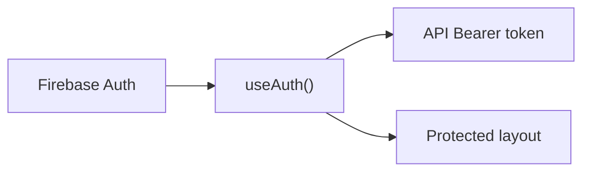
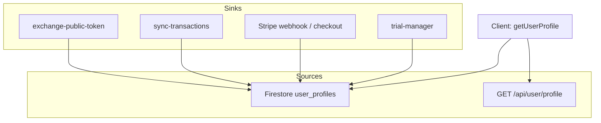
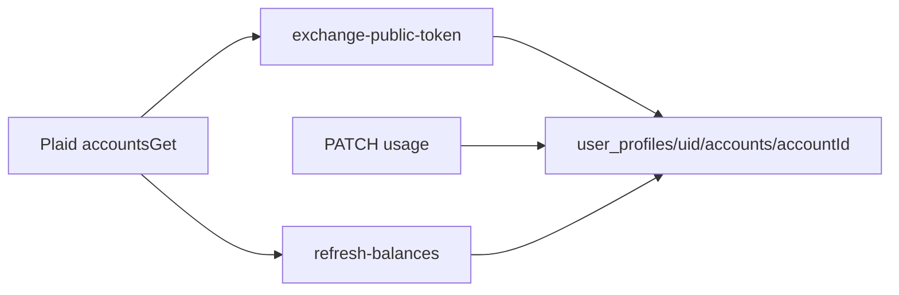
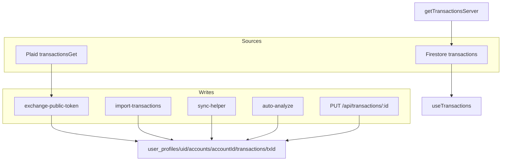
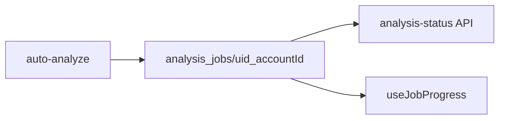
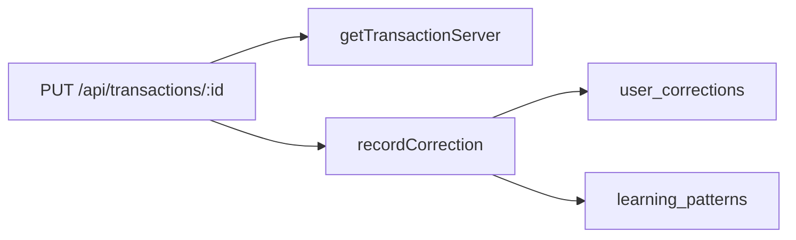

# Data Flow Maps

**Summary:** Where data comes from (sources) and where it goes (sinks) for the main entities: auth, user profile, accounts, transactions, analysis jobs, and learning. Includes Mermaid and ASCII. See [WORKFLOW_MAPS.md](WORKFLOW_MAPS.md) for flows and [ROUTES_AND_GATES.md](ROUTES_AND_GATES.md) for routes.

**Acronyms:** Firestore = Firebase Firestore; Plaid = bank-linking provider; UID = Firebase Auth User ID.

---

## 1. Auth and user identity

**ASCII**

```
Source: Firebase Auth (client)
  └─> useAuth() → { user, loading }
        └─> user.id (uid), user.email

Sinks:
  └─> API requests: Authorization: Bearer <getIdToken()>
  └─> Protected layout: if !user → redirect /auth/login
  └─> All protected pages: pass user.id for profile/transactions
```

**Mermaid**



---

## 2. User profile

**ASCII**

```
Sources:
  ├─> Firestore: user_profiles/{uid} (getDoc or get from server)
  └─> API: GET /api/user/profile (server reads user_profiles)

Writes (server/API only for sensitive fields):
  ├─> exchange-public-token: plaid_token, plaid_item_id, last_updated
  ├─> sync-transactions: plaid_transactions_cursor, last_sync
  ├─> Stripe webhook / checkout: stripeCustomerId, subscription fields
  ├─> trial-manager / subscriptions: trialStart, trialEnd, subscriptionStatus, etc.
  └─> PATCH profile (client-allowed fields only; subscription fields blocked in rules)

Key fields: plaid_token, plaid_item_id, usageType per account, subscription/trial, onboarding flags
```

**Mermaid**



---

## 3. Accounts (Plaid)

**ASCII**

```
Source:
  └─> Plaid: accountsGet(access_token) → list of accounts (id, name, type, mask, balances, ...)

Write (one-time per connection):
  └─> exchange-public-token: for each account
        └─> user_profiles/{uid}/accounts/{accountId}.set({ id, account_id, name, mask, type, subtype, balance, ... })

Updates:
  └─> PATCH /api/accounts/{accountId}/usage → usageType, businessUsePercent (stored on account or derived)
  └─> refresh-balances → balances from Plaid → account doc

Read:
  └─> Client: list accounts from Firestore (user_profiles/{uid}/accounts)
  └─> API: account lookup for auto-analyze, account-usage page
```

**Mermaid**



---

## 4. Transactions

**ASCII**

```
Sources (read):
  ├─> Client: useTransactions(uid)
  │     └─> collectionGroup('transactions').where(userId or user_id).orderBy('date')
  │     └─> Fallback: GET /api/transactions → getTransactionsServer(uid)
  ├─> Server: getTransactionsServer(uid), getTransactionServer(uid, transId)
  │     └─> collectionGroup + top-level transactions (userId/user_id), merge/dedup
  └─> Plaid: transactionsGet (paginated by offset) in exchange-public-token and sync

Writes:
  ├─> exchange-public-token: user_profiles/{uid}/accounts/{accountId}/transactions/{txId}
  │     └─> transactionData with undefined stripped
  ├─> import-transactions: same path, same strip-undefined
  ├─> sync-helper (createTransactionServer): same path
  ├─> auto-analyze: update same docs (analysis_status, is_deductible, ai, etc.)
  └─> PUT /api/transactions/[id]: updateTransactionServerWithUserId → doc.update (allowed keys only)

Important: Every transaction doc must have userId or user_id for collectionGroup rules; no undefined values.
```

**Mermaid**



---

## 5. Analysis jobs

**ASCII**

```
Source:
  └─> auto-analyze: creates/updates analysis_jobs/{jobId} where jobId = uid_accountId

Read:
  └─> GET /api/transactions/analysis-status?accountId=... (and analysis-job API)
  └─> useJobProgress (client) can subscribe to analysis_jobs doc

Write:
  └─> Server only (auto-analyze): status, processed, succeeded, failed, lastUpdate, etc.
```

**Mermaid**



---

## 6. Learning (corrections and patterns)

**ASCII**

```
Sources (read):
  ├─> user_corrections: where userId == uid (client read for history)
  └─> learning_patterns/{userId}: client read for suggestions

Writes:
  └─> PUT /api/transactions/[id] with correction
        └─> getTransactionServer(uid, transId) → original analysis
        └─> aiLearningEngine.recordCorrection(...)
              ├─> user_corrections/{correctionId}.set(cleanCorrection)  // strip undefined
              └─> updateLearningPatterns → learning_patterns/{userId}.set(cleanPatterns)
```

**Mermaid**



---

## 7. High-level data flow (ASCII)

```
                    ┌─────────────────┐
                    │  Firebase Auth  │
                    └────────┬────────┘
                             │ uid, token
         ┌───────────────────┼───────────────────┐
         ▼                   ▼                   ▼
  user_profiles/{uid}   API (Bearer)      Protected layout
         │                   │                   │
         ├─ plaid_token      ├─ transactions     └─ redirect if !user
         ├─ accounts/*       ├─ accounts
         └─ meta/progress    ├─ analysis-status
                 │           └─ auto-analyze
                 │
         ▼
  user_profiles/{uid}/accounts/{accountId}/transactions/{txId}
         │
         ├─ Read: useTransactions, getTransactionsServer
         └─ Write: exchange, import, sync, auto-analyze, PUT :id

  analysis_jobs/{uid_accountId}  ← auto-analyze
  user_corrections, learning_patterns ← recordCorrection
```

---

## Links to other docs

- [WORKFLOW_OVERVIEW.md](WORKFLOW_OVERVIEW.md)
- [WORKFLOW_MAPS.md](WORKFLOW_MAPS.md)
- [ROUTES_AND_GATES.md](ROUTES_AND_GATES.md)
- [STATE_MACHINES.md](STATE_MACHINES.md)
- [BREAKPOINTS_AND_FIXPLAN.md](BREAKPOINTS_AND_FIXPLAN.md)
