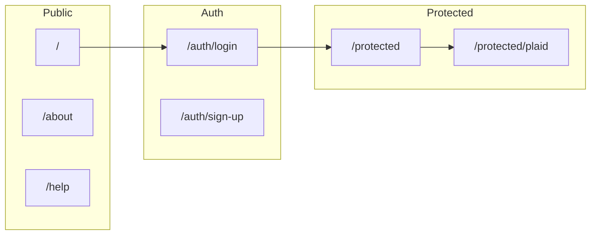

# Routes and Gates

**Summary:** Inventory of all app routes (Next.js App Router), with auth/bank requirements, key components, data fetched, and loading/empty/error handling. Use this to see what each URL does and what gates apply.

**Acronyms:** API = Application Programming Interface; UID = User ID (Firebase Auth); Plaid = bank-linking provider.

---

## Router type

**Next.js App Router** — routes are defined by folders under `app/`; each route has a `page.tsx` (and optionally `layout.tsx`). There is no root `middleware.ts`; auth is enforced in the **protected layout** and per-page where needed.



---

## ASCII route map

```
/ (Landing)
  ├── /about, /privacy, /contact, /help, /help-support
  ├── /welcome (post-signup; redirects to /protected if logged in)
  └── /auth/*
        ├── /auth/login
        ├── /auth/sign-up
        ├── /auth/sign-up-success
        ├── /auth/forgot-password
        ├── /auth/update-password
        ├── /auth/confirm
        └── /auth/error

/protected/*  (Auth required — layout redirects to /auth/login if no user)
  ├── /protected                    → main app (dashboard + screen state)
  ├── /protected/plaid              → Connected Banks list
  ├── /protected/plaid-link         → Plaid Link (connect bank)
  ├── /protected/account-usage/[id] → Classify account (business/personal/mixed)
  ├── /protected/transactions       → Transactions list page
  ├── /protected/settings
  ├── /protected/subscriptions
  ├── /protected/reports
  ├── /protected/schedule-c
  ├── /protected/scheduleSE
  ├── /protected/form8829, form4562, tax-forms-setup
  ├── /protected/profile-setup
  ├── /protected/about, help
  └── /protected/privacy

/stripe/success, /stripe/cancel  (post-checkout; auth assumed via session)
```

---

## Public routes (no auth)

| Route | Auth | Key components | Data | States |
|-------|------|----------------|------|--------|
| `/` | No | `LandingPage` | None | Static |
| `/about` | No | Page content | None | Static |
| `/privacy` | No | Page content | None | Static |
| `/contact` | No | Contact form | Submit → API | Loading, success, error |
| `/help` | No | Help content | None | Static |
| `/help-support` | No | Help/support | None | Static |

---

## Auth routes (login/signup)

| Route | Auth | Bank required | Key components | Data | States |
|-------|------|---------------|----------------|------|--------|
| `/auth/login` | No | No | `LoginForm` | Firebase Auth | Loading, error |
| `/auth/sign-up` | No | No | Sign-up form | Firebase Auth | Loading, error |
| `/auth/sign-up-success` | No | No | Success message | None | Static |
| `/auth/forgot-password` | No | No | Forgot password form | Firebase Auth | Loading, success, error |
| `/auth/update-password` | No | No | Update password form | Firebase Auth | Loading, error |
| `/auth/confirm` | No | No | Email confirmation | Firebase Auth | Loading, redirect |
| `/auth/error` | No | No | Error display | None | Static |

**Gate:** Unauthenticated users can access these. After login/signup, app typically redirects to `/protected` or `/welcome`.

---

## Onboarding / post-auth

| Route | Auth | Bank required | Key components | Data | States |
|-------|------|---------------|----------------|------|--------|
| `/welcome` | Optional | No | `HomeContent` or redirect | `useAuth` | Loading, redirect if user → `/protected`, else home content |

---

## Protected routes (auth required)

All routes under `app/protected/` use `ProtectedLayoutClient`, which:

- Uses `useAuth()`; if `!user` and not loading → `router.replace('/auth/login')`.
- Loads `userProfile` via `getUserProfile(user.id)`; can show profile-setup mode if no profile.
- Shows loading spinner while `loading || profileLoading`; shows "Redirecting to login..." when no user.

**Bank connection** is not required to view protected routes; features that need transactions (e.g. Review, Reports) show empty/CTA states or prompts to connect a bank.

| Route | Auth | Bank typical | Key components | Data | States |
|-------|------|--------------|----------------|------|--------|
| `/protected` | Yes | Optional | `DashboardScreen`, `ReviewTransactionsScreen`, `SettingsScreen`, etc. (screen state + query `screen`) | `useTransactions(uid)`, `getUserProfile`, sync on visit if bank connected | Loading, profile setup, dashboard, empty transactions |
| `/protected/plaid` | Yes | No | `PlaidScreen` | User profile (Plaid token), accounts from Firestore | Empty (connect CTA), list of connected accounts |
| `/protected/plaid-link` | Yes | No | `PlaidLinkScreen` | Link token from `/api/plaid/create-link-token` | Loading token, Plaid Link, success → redirect account-usage |
| `/protected/account-usage/[accountId]` | Yes | Yes (just connected) | Account usage form | Account id from URL, `?imported=` from query | Form (business/personal/mixed), save → auto-analyze or redirect |
| `/protected/transactions` | Yes | Optional | Transactions list page | Transactions (API or hook) | Loading, list, empty |
| `/protected/settings` | Yes | No | `SettingsScreen` | User profile | Loading, form, error |
| `/protected/subscriptions` | Yes | No | Subscriptions / Stripe | Profile, Stripe APIs | Loading, plan selection, portal |
| `/protected/reports` | Yes | Optional | Reports page | Transactions, report config | Loading, PDF/export, paywall |
| `/protected/schedule-c` | Yes | Optional | Schedule C | Transactions, tax data | Loading, form, export |
| `/protected/scheduleSE`, `form8829`, `form4562`, `tax-forms-setup` | Yes | Optional | Tax forms | Profile, transactions | Loading, form |
| `/protected/profile-setup` | Yes | No | Profile setup | Profile API | Loading, steps, submit |
| `/protected/about`, `help`, `privacy` | Yes | No | Static-style content | None | Static |

---

## API routes (server)

Auth for API routes is typically **Bearer token** in `Authorization` header (Firebase IdToken). Many routes use `getUserFromReqOrThrow(req)` and return 401 if missing/invalid.

| Group | Route pattern | Auth | Purpose |
|-------|----------------|------|--------|
| **Auth** | `POST /api/auth/session` | Optional | Session check |
| | `POST /api/auth/logout` | Yes | Logout |
| **Plaid** | `POST /api/plaid/create-link-token` | Yes | Create Plaid link token |
| | `POST /api/plaid/exchange-public-token` | Yes | Exchange token, store accounts, import transactions |
| | `POST /api/plaid/sync-transactions` | Yes | Incremental or full sync |
| | `POST /api/plaid/auto-analyze` | Yes | Start AI analysis for an account |
| | `GET /api/transactions/analysis-status` | Yes | Analysis job status |
| | `POST /api/plaid/refresh-balances` | Yes | Refresh account balances |
| | Others: get-accounts, accounts, import-transactions, webhook, etc. | Varies | See `app/api/plaid/*` |
| **Transactions** | `GET/POST /api/transactions` | Yes | List/create transactions |
| | `GET/PUT /api/transactions/[id]` | Yes | Get/update one transaction |
| | `GET /api/transactions/analysis-status` | Yes | Per-account analysis status |
| **Accounts** | `PATCH /api/accounts/[accountId]/usage` | Yes | Set business/personal/mixed |
| | `POST /api/accounts/[accountId]/mark-personal` | Yes | Mark all transactions personal |
| **Stripe** | `POST /api/stripe/create-checkout` | Yes | Create checkout session |
| | `POST /api/stripe/create-portal-session` | Yes | Customer portal |
| | `POST /api/stripe/webhook` | No (Stripe signature) | Webhook |
| **Reports / Tax** | `/api/tax/*`, `/api/reports/*` | Yes | Export, PDF, schedule C, etc. |
| **User** | `/api/user/profile`, export, delete | Yes | Profile, export, delete |
| **Other** | `/api/contact`, upload-receipt, subscriptions, etc. | Varies | Feature-specific |

---

## Gates summary

| Gate | Where | Behavior |
|------|--------|----------|
| **Auth required** | All `/protected/*` | `ProtectedLayoutClient`: no user → redirect to `/auth/login`. |
| **Auth required** | Most API routes | `getUserFromReqOrThrow(req)` → 401 if no valid Bearer token. |
| **Bank connection** | Not a hard gate | App and API work without Plaid; connect bank for transactions, sync, and analysis. |
| **Profile exists** | Protected layout | If no profile, layout can show profile-setup mode (e.g. first-time flow). |
| **Subscription / historical access** | Transaction date range, some reports | `getTransactionDateRange(uid)` and subscription checks limit date range or features. |

---

## Links to other docs

- [WORKFLOW_OVERVIEW.md](WORKFLOW_OVERVIEW.md) — What the app does and main user journeys.
- [WORKFLOW_MAPS.md](WORKFLOW_MAPS.md) — Detailed workflow maps.
- [DATA_FLOW_MAPS.md](DATA_FLOW_MAPS.md) — Where data comes from and goes.
- [STATE_MACHINES.md](STATE_MACHINES.md) — Screen and analysis state.
- [BREAKPOINTS_AND_FIXPLAN.md](BREAKPOINTS_AND_FIXPLAN.md) — Where things can break and how to fix.
