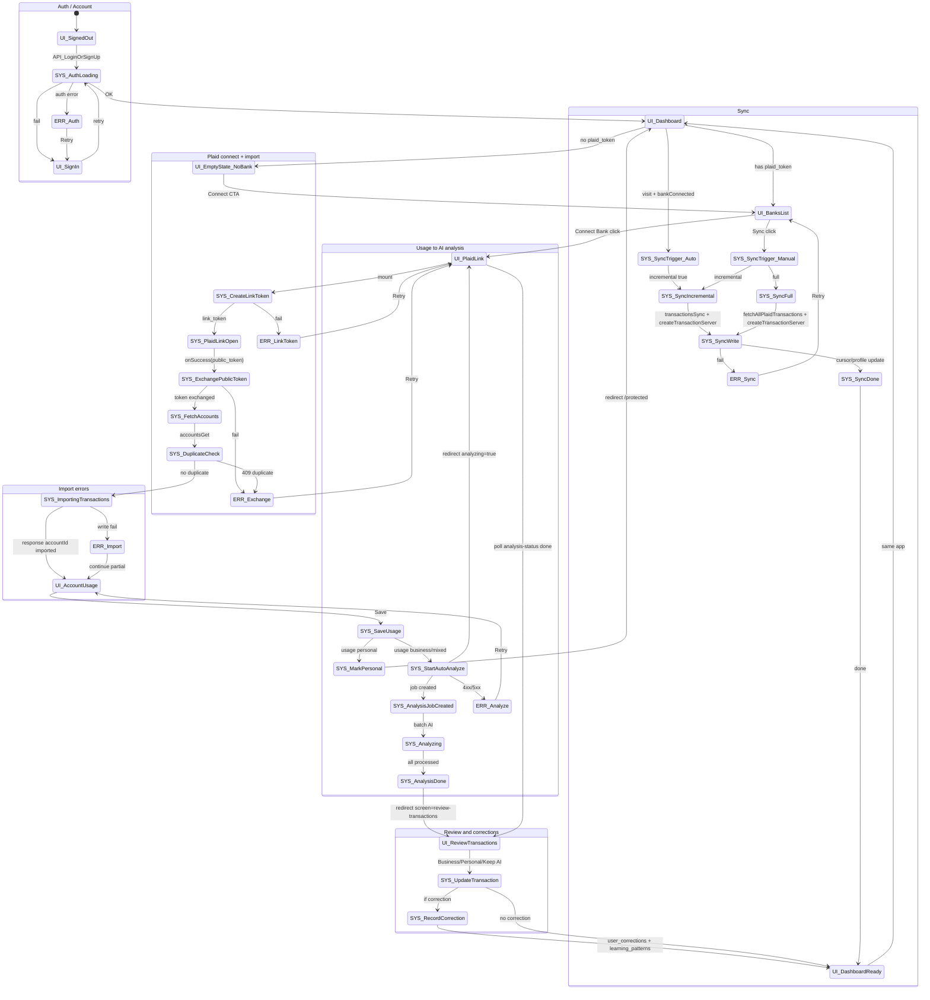

# State diagram from app (code = source of truth)

End-to-end flow as implemented: **Account creation/sign-in → Plaid connect → first import → account usage (business/personal/mixed) → AI analysis → review transactions → sync (incremental/full)**. All states and transitions below are derived from the codebase.

---

## 1. Found in code

### UI routes (pages)

| Route | Component / content |
|-------|---------------------|
| `/` | LandingPage (app/page.tsx) |
| `/auth/login` | LoginForm (app/auth/login/page.tsx) |
| `/auth/sign-up` | Sign-up form (app/auth/sign-up/page.tsx) |
| `/auth/sign-up-success` | Success message (app/auth/sign-up-success/page.tsx) |
| `/auth/forgot-password`, `/auth/update-password`, `/auth/confirm`, `/auth/error` | Auth flows |
| `/welcome` | HomeContent or redirect to /protected if user (app/welcome/page.tsx) |
| `/protected` | ProtectedLayoutClient + app content; screen state via `?screen=` (app/protected/page.tsx). Renders DashboardScreen, ReviewTransactionsScreen, PlaidScreen, etc. by currentScreen |
| `/protected/plaid` | PlaidScreen — banks list, "Connect Bank" → /protected/plaid-link (app/protected/plaid/page.tsx) |
| `/protected/plaid-link` | PlaidLinkScreen — link token, Plaid Link, exchange, then redirect to account-usage (app/protected/plaid-link/page.tsx, components/plaid-link-screen.tsx) |
| `/protected/account-usage/[accountId]` | Account usage form — Business/Personal/Mixed, Save → PATCH usage, mark-personal or auto-analyze, redirect (app/protected/account-usage/[accountId]/page.tsx) |
| `/protected/transactions` | Transactions list page (app/protected/transactions/page.tsx) |
| `/protected/settings`, `/protected/subscriptions`, `/protected/reports`, `/protected/schedule-c`, etc. | Other protected pages |

**Note:** Review transactions is a **screen** on `/protected` (`currentScreen === 'review-transactions'`), not a separate route. Navigation uses `?screen=review-transactions&accountId=...`.

### API endpoints (handlers)

| Method + path | Handler file | Purpose |
|----------------|--------------|---------|
| POST `/api/plaid/create-link-token` | app/api/plaid/create-link-token/route.ts | Plaid linkTokenCreate, return link_token |
| POST `/api/plaid/exchange-public-token` | app/api/plaid/exchange-public-token/route.ts | itemPublicTokenExchange, write user_profiles + accounts + transactions |
| PATCH `/api/accounts/[accountId]/usage` | app/api/accounts/[accountId]/usage/route.ts | setAccountUsageServer(uid, accountId, usageType, businessUsePercent) |
| POST `/api/accounts/[accountId]/mark-personal` | app/api/accounts/[accountId]/mark-personal/route.ts | Mark all account transactions personal |
| POST `/api/plaid/auto-analyze` | app/api/plaid/auto-analyze/route.ts | Create/update analysis_jobs/{uid_accountId}, getPendingTransactions, analyzeTransactionWithRetry, update transaction docs |
| GET `/api/transactions/analysis-status?accountId=` | app/api/transactions/analysis-status/route.ts | Read analysis_jobs / getTransactionsServer, return counts by status |
| POST `/api/plaid/sync-transactions` | app/api/plaid/sync-transactions/route.ts | syncUserTransactionsIncremental(uid) or syncUserTransactions(uid, import_timeframe) |
| GET `/api/transactions`, GET `/api/transactions/[id]`, PUT `/api/transactions/[id]` | app/api/transactions/route.ts, app/api/transactions/[id]/route.ts | List/get/update transaction; PUT calls updateTransactionServerWithUserId, getTransactionServer, aiLearningEngine.recordCorrection |

### Firestore paths (from code)

| Path | Usage |
|------|--------|
| `user_profiles/{uid}` | Profile doc: plaid_token, plaid_item_id, plaid_transactions_cursor, last_sync, subscription/trial (lib/firebase/profiles-server.ts, exchange-public-token, sync-helper) |
| `user_profiles/{uid}/accounts/{accountId}` | Account doc (exchange-public-token, accounts-server) |
| `user_profiles/{uid}/accounts/{accountId}/transactions/{txId}` | Transaction docs (exchange-public-token, import-transactions, transactions-server createTransactionServer, auto-analyze updates) |
| `user_profiles/{uid}/meta/progress` | Review flow progress (lib/firebase/progress.ts) |
| `analysis_jobs/{jobId}` | jobId = `{uid}_{accountId}`; auto-analyze creates/updates (app/api/plaid/auto-analyze/route.ts); useJobProgress subscribes (lib/hooks/useJobProgress.ts) |
| `analysis_status/{jobId}` | Legacy; analysis-status API can fall back (app/api/transactions/analysis-status/route.ts) |
| `user_corrections/{correctionId}` | recordCorrection (lib/ai/learning-engine.ts) |
| `learning_patterns/{userId}` | updateLearningPatterns (lib/ai/learning-engine.ts) |

---

## 2. Mermaid state diagram (stateDiagram-v2)

---

## 3. Ambiguities / TODOs

- **Review screen as route:** The app does not have a route `/protected/review-transactions`. Review is a **screen** on `/protected` with `?screen=review-transactions&accountId=...`. The diagram uses `UI_ReviewTransactions` as the logical state; the URL can be `/protected` with query params.
- **Sync trigger from BanksDetailScreen:** Manual sync is also triggered from `components/banks-detail-screen.tsx` (Sync button). The diagram groups this under `SYS_SyncTrigger_Manual`; both PlaidScreen and BanksDetailScreen call `POST /api/plaid/sync-transactions`.
- **analysis_status vs analysis_jobs:** The code uses `analysis_jobs` for new flow (auto-analyze) and can fall back to `analysis_status` in analysis-status API. The diagram does not distinguish; both represent “job progress.”
- **Profile setup branch:** If the user has no profile doc, ProtectedLayoutClient can show profile-setup mode (full-width, no nav). The diagram does not add a separate state; it is a variant of “dashboard loading” before UI_Dashboard.

No missing steps were found that require an `ERR_MissingStep` state; all transitions above have a matching call chain in the repo.
