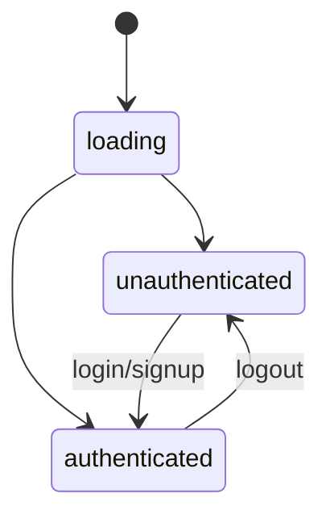
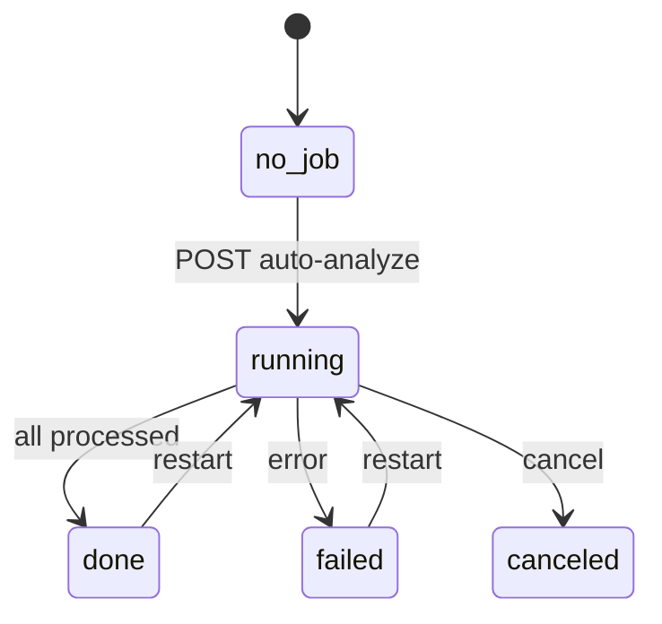
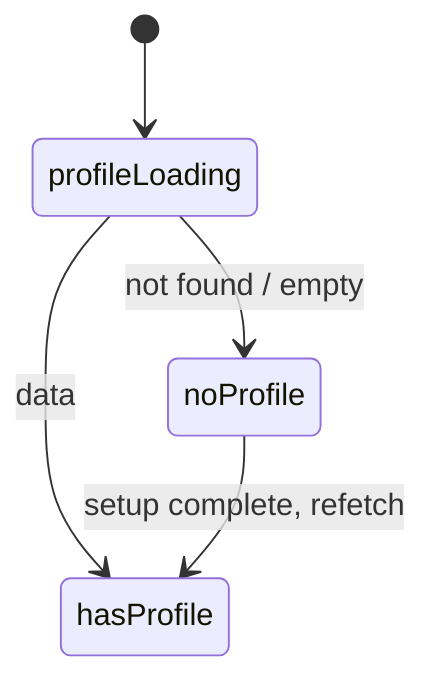
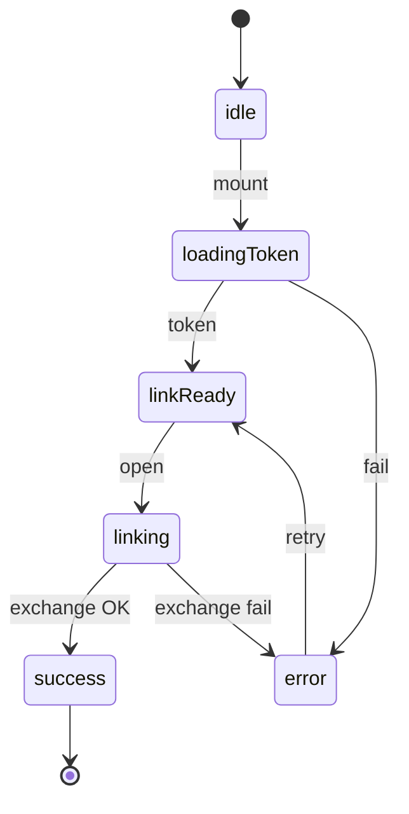
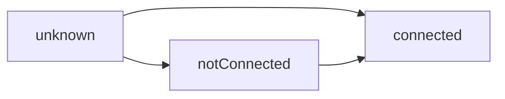

# State Machines

**Summary:** Main state machines in the app: protected app screen state, auth state, analysis job state, and profile/onboarding. Each has a short description, Mermaid diagram, and ASCII. See [WORKFLOW_MAPS.md](WORKFLOW_MAPS.md) for flows.

---

## 1. Protected app screen state

The main `/protected` page holds a single `currentScreen`; URL params can set or override it (e.g. `?screen=review-transactions&accountId=...`).

**ASCII**

```
States: dashboard | settings | add-expense | receipt-upload | tax-calendar | transactions
        | review-transactions | schedule-c-export | edit-expense | deductions-detail
        | expenses-detail | banks-detail | profit-loss-detail | categories
        | plaid-link | plaid | transaction-detail | reports | ai-insights | quarterly-taxes

Transitions:
  Sidebar/Nav click → setCurrentScreen(screen)
  URL searchParams.screen → setCurrentScreen(screen)
  Plaid success → router.push account-usage or review-transactions
  Transaction click → setCurrentScreen('transaction-detail'); setViewingTransaction(tx)
  Back → router.back() or setCurrentScreen(navigationStack)
```

**Mermaid**

```mermaid
stateDiagram-v2
  [*] --> dashboard
  dashboard --> settings
  dashboard --> transactions
  dashboard --> review-transactions
  dashboard --> plaid
  plaid --> plaid-link
  plaid-link --> review-transactions
  review-transactions --> transaction-detail
  transaction-detail --> review-transactions
  dashboard --> reports
  dashboard --> schedule-c-export
  settings --> dashboard
  transactions --> transaction-detail
```

---

## 2. Auth state (client)

**ASCII**

```
States: loading | unauthenticated | authenticated

  loading: useAuth() not yet resolved
  unauthenticated: user === null → redirect /auth/login on protected routes
  authenticated: user !== null → allow protected; pass user.id to hooks/API

Transitions:
  load → Firebase onAuthStateChanged → authenticated | unauthenticated
  login/signup success → authenticated
  logout → unauthenticated
```

**Mermaid**



---

## 3. Analysis job state (per account)

**ASCII**

```
States: (no job) | running | done | failed | canceled

  (no job): analysis_jobs/{uid_accountId} does not exist or not yet created
  running: status === 'running'; processed < total
  done: status === 'done'
  failed: status === 'failed'
  canceled: status === 'canceled'

Transitions:
  POST auto-analyze → create/update job → running
  Each batch completion → update processed/succeeded/failed; if processed >= total → done
  Error in batch → failed (or continue and mark failed count)
  Client can poll analysis-status or subscribe to job doc (useJobProgress)
```

**Mermaid**



---

## 4. Profile / onboarding state (layout)

**ASCII**

```
States: profileLoading | noProfile (profile setup) | hasProfile

  profileLoading: fetching getUserProfile(user.id)
  noProfile: profile not found or incomplete → show profile-setup mode (full-width, no nav)
  hasProfile: profile exists → show sidebar/nav and main content

Transitions:
  user set → profileLoading
  profile fetch success + data → hasProfile
  profile fetch "not found" or empty → noProfile (setIsProfileSetup(true))
  Profile setup complete → refetch → hasProfile
```

**Mermaid**



---

## 5. Plaid Link flow (local UI)

**ASCII**

```
States: idle | loadingToken | linkReady | linking | success | error

  idle: initial
  loadingToken: POST create-link-token in progress
  linkReady: linkToken set; react-plaid-link can open
  linking: user in Plaid Link modal
  success: exchange-public-token 200; redirect to account-usage
  error: token or exchange failed; show message

Transitions:
  mount → loadingToken
  token received → linkReady
  user opens link → linking
  onSuccess(public_token) → exchange call → success | error
```

**Mermaid**



---

## 6. Bank connection (app-level)

**ASCII**

```
States: unknown | notConnected | connected

  unknown: not yet checked (e.g. before getUserProfile)
  notConnected: !profile?.plaid_token
  connected: profile?.plaid_token

Used for: showing "Connect Bank" CTA, enabling sync-on-visit, showing transaction-dependent screens
Transitions: after getUserProfile(uid) in protected page or layout → notConnected | connected
```

**Mermaid**



---

## Links to other docs

- [WORKFLOW_OVERVIEW.md](WORKFLOW_OVERVIEW.md)
- [WORKFLOW_MAPS.md](WORKFLOW_MAPS.md)
- [ROUTES_AND_GATES.md](ROUTES_AND_GATES.md)
- [DATA_FLOW_MAPS.md](DATA_FLOW_MAPS.md)
- [BREAKPOINTS_AND_FIXPLAN.md](BREAKPOINTS_AND_FIXPLAN.md)
