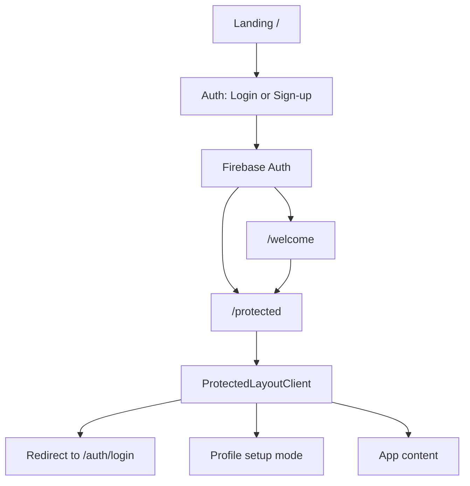
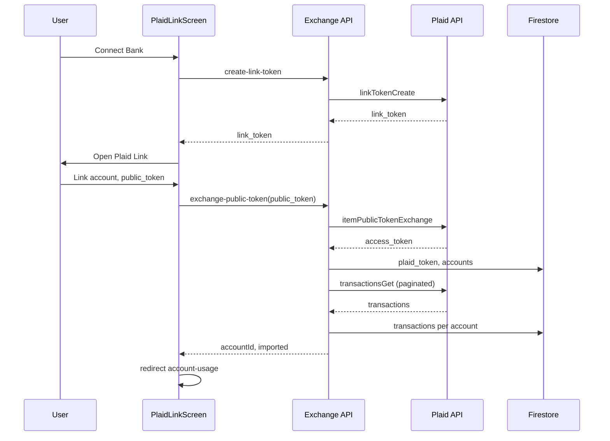
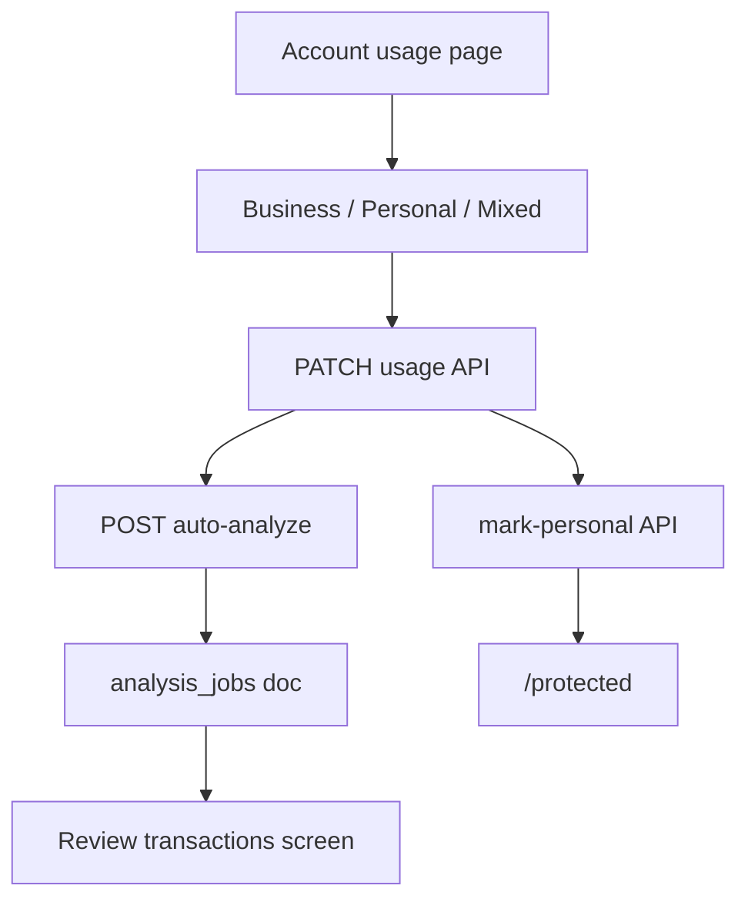
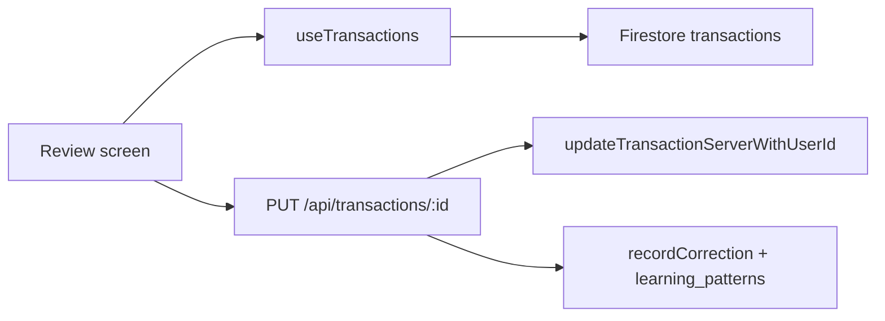
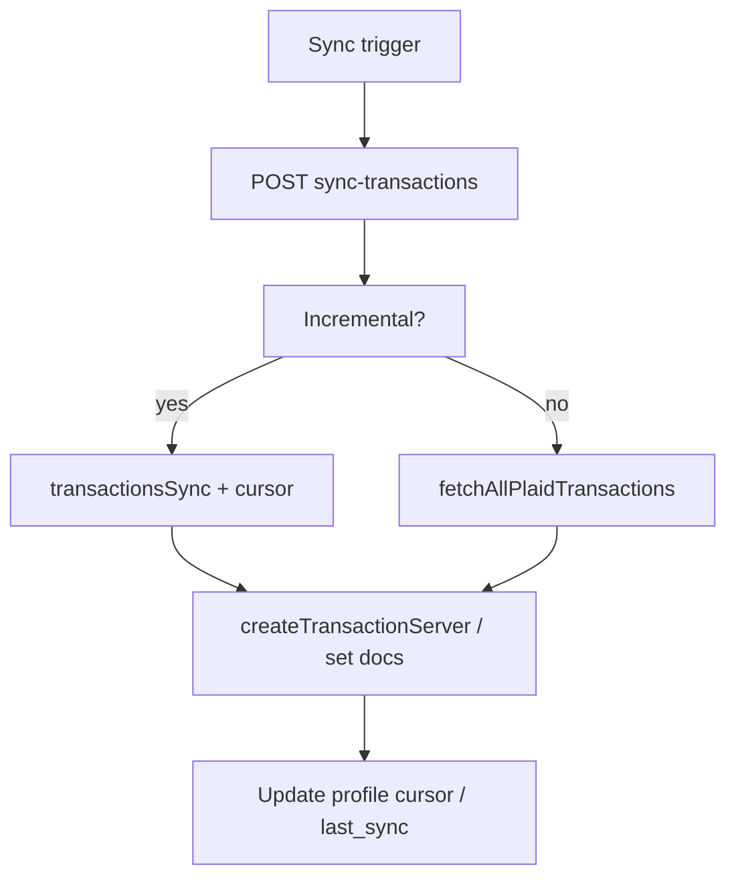
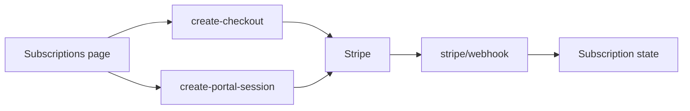

# Workflow Maps

**Summary:** Detailed workflow maps for main flows: auth, Plaid connection, account classification, review/categorize, sync, and subscription. Each section has Mermaid and ASCII. See [WORKFLOW_OVERVIEW.md](WORKFLOW_OVERVIEW.md) for the one-page view and [ROUTES_AND_GATES.md](ROUTES_AND_GATES.md) for routes.

---

## 1. Auth and entry

**ASCII**

```
Landing (/)     →  Sign up / Login  →  /auth/login or /auth/sign-up
                      │
                      ▼
              Firebase Auth (email/password)
                      │
          ┌──────────┴──────────┐
          ▼                     ▼
    /welcome (if new)      /protected (if returning)
          │                     │
          └─────────────────────┘
                      │
                      ▼
              ProtectedLayoutClient
                      │
         ┌────────────┼────────────┐
         ▼            ▼            ▼
    No user?    No profile?   OK → children
    → /auth/login  → profile setup   (dashboard, etc.)
```

**Mermaid**



---

## 2. Plaid connection and first import

**ASCII**

```
/protected/plaid (Banks list)
  └─> "Connect Bank" → /protected/plaid-link
        │
        ├─> POST /api/plaid/create-link-token (Bearer token)
        │     └─> Plaid linkTokenCreate → { link_token }
        │
        ├─> react-plaid-link opens; user selects institution, links
        │
        └─> onSuccess(public_token)
              └─> POST /api/plaid/exchange-public-token { public_token }
                    ├─> itemPublicTokenExchange → access_token, item_id
                    ├─> Write user_profiles/{uid}: plaid_token, plaid_item_id
                    ├─> accountsGet → list accounts
                    ├─> Duplicate check: any account_id already in user_profiles/{uid}/accounts? → 409
                    ├─> Per account: write user_profiles/{uid}/accounts/{accountId}
                    ├─> Per account: fetchAllPlaidTransactions (offset pagination, options.account_ids)
                    ├─> Per tx: user_profiles/{uid}/accounts/{accountId}/transactions/{txId} (strip undefined)
                    └─> Response: { accountId, imported }
              │
              └─> Redirect → /protected/account-usage/{accountId}?imported={n}
```

**Mermaid**



---

## 3. Account classification and analysis

**ASCII**

```
/protected/account-usage/[accountId]
  │
  ├─> User chooses: Business | Personal | Mixed (with %)
  │
  └─> Save
        ├─> PATCH /api/accounts/{accountId}/usage { usageType, businessUsePercent? }
        │
        ├─> If Personal:
        │     └─> POST /api/accounts/{accountId}/mark-personal
        │     └─> Redirect → /protected
        │
        └─> If Business or Mixed:
              └─> POST /api/plaid/auto-analyze { accountId }
              │     ├─> Ensure account exists (user_profiles/{uid}/accounts/{accountId})
              │     ├─> jobId = uid_accountId; analysis_jobs/{jobId}
              │     ├─> Load pending transactions (getPendingTransactions from user_profiles/{uid}/accounts/{accountId}/transactions), batch AI (analyzeTransactionWithRetry)
              │     └─> Update transaction docs + job progress
              │
              ├─> If many pending: redirect → /protected?screen=plaid-link&accountId=...&analyzing=true
              │     └─> Poll analysis-status; on done → /protected?screen=review-transactions&accountId=...
              │
              └─> Else: redirect → /protected?screen=review-transactions&accountId=...
```

**Mermaid**



---

## 4. Review transactions and corrections

**ASCII**

```
/protected (screen=review-transactions)
  │
  ├─> transactions from useTransactions(uid) [collectionGroup or API fallback]
  │
  └─> For each transaction: User chooses Business | Personal | Keep AI
        └─> PUT /api/transactions/{transactionId}
              ├─> updateTransactionServerWithUserId(uid, transactionId, updates)
              │     └─> collectionGroup find → doc.ref.update (strip undefined)
              │
              └─> If user correction (overriding AI):
                    ├─> getTransactionServer(uid, transactionId) → original analysis
                    └─> aiLearningEngine.recordCorrection(...)
                          ├─> Build UserCorrection (strip undefined: JSON.parse(JSON.stringify))
                          ├─> user_corrections/{id}.set(cleanCorrection)
                          └─> updateLearningPatterns → learning_patterns/{userId}
```

**Mermaid**



---

## 5. Sync (incremental and full)

**ASCII**

```
Sync triggers:
  ├─> On visit: /protected load, bankConnected → POST sync-transactions { incremental: true } (once per visit)
  └─> Manual: PlaidScreen or BanksDetailScreen "Sync" → POST sync-transactions

POST /api/plaid/sync-transactions { userId, import_timeframe?, incremental? }
  │
  ├─> incremental === true
  │     └─> syncUserTransactionsIncremental(uid)
  │           ├─> Get plaid_transactions_cursor from user profile
  │           ├─> Loop: plaidClient.transactionsSync({ cursor }) → added, modified, removed
  │           ├─> Write new transactions via createTransactionServer
  │           └─> Update profile: plaid_transactions_cursor, last_sync
  │
  └─> Else (full)
        └─> syncUserTransactions(uid, import_timeframe)
              ├─> getTransactionDateRange(uid) → start/end dates
              ├─> fetchAllPlaidTransactions (no account_ids) → all accounts
              └─> createTransactionServer per transaction
```

**Mermaid**



---

## 6. Subscription and Stripe

**ASCII**

```
/protected/subscriptions
  └─> Create checkout or open portal
        ├─> POST /api/stripe/create-checkout → Stripe session → redirect Stripe
        └─> POST /api/stripe/create-portal-session → Stripe portal → redirect Stripe

Stripe redirects:
  └─> /stripe/success or /stripe/cancel
        └─> Back to /protected or /protected?screen=transactions

Webhook:
  └─> POST /api/stripe/webhook (Stripe signature verified)
        └─> Update subscription state (e.g. customer, subscription); app uses for historical access / paywalls
```

**Mermaid**



---

## Links to other docs

- [WORKFLOW_OVERVIEW.md](WORKFLOW_OVERVIEW.md)
- [ROUTES_AND_GATES.md](ROUTES_AND_GATES.md)
- [DATA_FLOW_MAPS.md](DATA_FLOW_MAPS.md)
- [STATE_MACHINES.md](STATE_MACHINES.md)
- [BREAKPOINTS_AND_FIXPLAN.md](BREAKPOINTS_AND_FIXPLAN.md)
