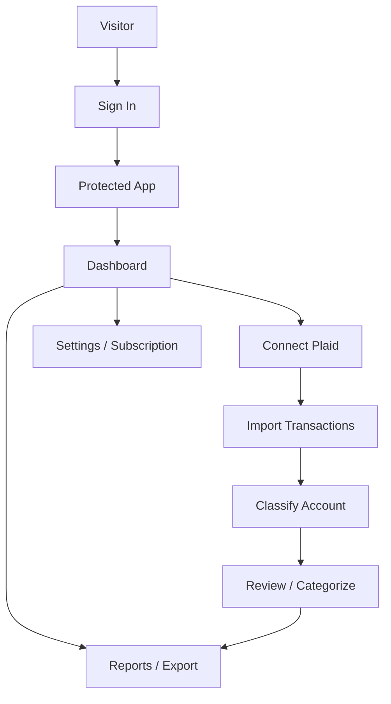

# Workflow Overview

**Summary:** One-page view of what the app does, primary user journeys, and a high-level map. For route details see [ROUTES_AND_GATES.md](ROUTES_AND_GATES.md); for flows see [WORKFLOW_MAPS.md](WORKFLOW_MAPS.md).

---

## What the app does (5 bullets)

1. **Connect bank accounts** — Users link checking/credit accounts via Plaid (Connected Banks → Connect Bank → Plaid Link). Transactions are imported and stored per account under the user profile.

2. **Classify and analyze transactions** — After connecting, the user classifies each account as Business, Personal, or Mixed. For business/mixed, the app runs AI analysis to suggest tax deductibility. Users can confirm or override (Review Transactions).

3. **Track deductions and learn preferences** — User corrections (business vs personal) are stored and used by a learning engine to improve future suggestions (e.g. by merchant or category).

4. **Reports and tax export** — Users can generate reports, Schedule C, and other tax-related exports from categorized transactions (with subscription/historical access where applicable).

5. **Subscription and trial** — Access to historical transaction range and some features is gated by an app-managed free trial or paid subscription (Stripe); Plaid connection can start a trial.

---

## Primary user journeys

- **New user:** Landing → Sign up → (Welcome) → Protected → Profile setup (if needed) → Dashboard. Optionally: Connect Bank → Plaid Link → Account classification → Review transactions.
- **Returning user (no bank):** Login → Protected → Dashboard. Connect Bank from sidebar/plaid page → same Plaid → classify → review.
- **Returning user (with bank):** Login → Protected → incremental sync on visit → Dashboard / Transactions / Reports. Can sync again from Banks or Settings; can run analysis or review/correct transactions.
- **Subscription:** From Settings or paywalled feature → Subscriptions → Stripe Checkout or portal → success/cancel back to app.

---

## High-level map (ASCII)

```
Visitor
  └─> Sign In (/auth/login)
        └─> Protected (/protected)
              ├─> Dashboard (default screen)
              │     ├─> Connect Plaid (/protected/plaid → plaid-link)
              │     │     └─> Exchange token → Import transactions
              │     │           └─> Account usage (/protected/account-usage/[id])
              │     │                 ├─> Personal → Mark all personal → Dashboard
              │     │                 └─> Business/Mixed → Auto-analyze
              │     │                       └─> Review transactions (screen or plaid-link progress)
              │     │                             └─> Categorize / correct → Learning engine
              │     ├─> Sync transactions (on visit if bank connected; or manual from Banks)
              │     └─> Reports / Schedule C / Export (subscription gated where applicable)
              ├─> Transactions (/protected/transactions or screen=transactions)
              ├─> Banks (/protected/plaid) → Sync / Connect / Disconnect
              ├─> Settings (/protected/settings)
              └─> Subscriptions (/protected/subscriptions) → Stripe checkout/portal
```

---

## Mermaid: top-level flow



---

## Links to other docs

- [ROUTES_AND_GATES.md](ROUTES_AND_GATES.md) — Full route list and auth/bank gates.
- [WORKFLOW_MAPS.md](WORKFLOW_MAPS.md) — Detailed workflow maps.
- [DATA_FLOW_MAPS.md](DATA_FLOW_MAPS.md) — Data sources and sinks.
- [STATE_MACHINES.md](STATE_MACHINES.md) — Screen and analysis state.
- [BREAKPOINTS_AND_FIXPLAN.md](BREAKPOINTS_AND_FIXPLAN.md) — Failure points and fix strategies.
